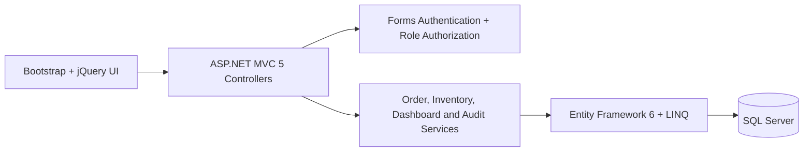

# OrderFlow

OrderFlow is a **GitHub-ready enterprise-style Order and Inventory Management System** built around a controlled fulfilment lifecycle. It includes a complete **ASP.NET MVC 5 / .NET Framework 4.8 / Entity Framework 6 / SQL Server** reference implementation, a normalized SQL schema and seed data, responsive Razor views, and an interactive operations-dashboard demonstration for immediate exploration.

> **Business purpose:** keep customer, product, inventory, order, and service-request activity in one accountable operational flow.

## Delivered Components

| Location | Contents |
| --- | --- |
| `OrderFlow.sln` | Visual Studio solution entry point. |
| `OrderFlow.MVC/` | ASP.NET MVC 5 application source: models, controllers, services, Razor views, authorization, and assets. |
| `database/OrderFlow.Database.sql` | SQL Server schema, primary/foreign keys, check constraints, indexes, and representative master-data seed. |
| `docs/ER-Diagram.mmd` | Source for the entity relationship diagram. |
| `docs/Architecture-Diagram.mmd` | Source for the logical architecture diagram. |
| `docs/INTERVIEW_GUIDE.md` | Interview narrative, design reasoning, demonstration script, and common follow-ups. |
| `docs/TEST_PLAN.md` | Validation record and targeted manual test plan. |
| `client/` | Interactive responsive operations-dashboard demonstration used for visual review and screenshots. |

## Core Modules

| Module | Included capabilities |
| --- | --- |
| Customer Management | Customer registration, profiles, contacts, account status, and linked order history. |
| Product Management | Category-backed product CRUD, SKU uniqueness, pricing, status, initial inventory, and reorder level. |
| Inventory Management | Stock-in/out, adjustments, availability, low-stock view, transaction history, reservations, and shipping stock-out. |
| Order Management | Multi-item orders, quantity validation, server-side totals, tax calculation, customer selection, audit events, and the controlled workflow below. |
| Customer Requests | Request type, description, priority, status, linked order, assignment, resolution, and customer-visible communication history. |
| Dashboard | Customer, product, order, pending/completed, low-stock, revenue, recent-order, and stock-risk signals. |

## Order Lifecycle

```text
Created → Confirmed → Processing → Shipped → Delivered → Completed
```

The progression is deliberately forward-only. `OrderService.IsValidTransition` protects the business rule on the server rather than trusting a client-side status control. New orders reserve available inventory. The **Shipped** transition consumes that reservation and writes a `StockOut` transaction, which preserves a clear distinction between promised stock and physically dispatched stock.

## Roles and Access

| Role | Primary access |
| --- | --- |
| Admin | Full administration; customer, product, inventory, order, and request access. |
| Sales Executive | Customer CRUD, order workflow, and customer request handling. |
| Inventory Manager | Product management, inventory operations, inventory history, permitted order status actions, and request handling. |
| Customer | Restricted portal access to their own service requests and linked order context. |

Authorization is enforced by a custom `AuthorizeRoleAttribute` applied to controllers/actions. Authentication uses Forms Authentication and a custom principal; passwords are PBKDF2-SHA256 hashes with unique salts. The implementation uses ASP.NET MVC 5 patterns for model binding, validation, routing, Razor views, LINQ, Entity Framework, and anti-forgery protection. The relevant framework APIs are documented by Microsoft for [MVC authorization][1], [EF6 Code First][2], and [Forms Authentication][3].

## Architecture

The presentation layer contains responsive Razor views enhanced with Bootstrap and jQuery. Controllers orchestrate model binding and authorization, while services own business rules. Entity Framework 6 translates LINQ projections and updates into SQL Server operations. The schema holds current inventory in `Inventory` and immutable operational movements in `InventoryTransactions`.



For the detailed diagrams, see [ER-Diagram.mmd](docs/ER-Diagram.mmd) and [Architecture-Diagram.mmd](docs/Architecture-Diagram.mmd).

## Local Setup — Visual Studio / Windows

### Prerequisites

Install **Visual Studio 2022** with the **ASP.NET and web development** workload, .NET Framework 4.8 targeting pack, SQL Server Express/LocalDB or SQL Server Developer Edition, and NuGet package restore enabled. ASP.NET MVC 5 targets the classic .NET Framework application model, so it should be opened and executed on Windows/IIS Express rather than the Linux-based browser demonstration environment.

### Configure and run

1. Clone the repository and open `OrderFlow.sln` in Visual Studio.
2. Restore packages using **Restore NuGet Packages**. The project pins MVC 5.2.9, Entity Framework 6.4.4, jQuery 3.7.1, and Bootstrap 5.3.3 in `OrderFlow.MVC/packages.config`.
3. Select **OrderFlow.MVC** as the startup project.
4. Choose one database initialization route:
   - For application-owned development data, retain the LocalDB connection in `OrderFlow.MVC/Web.config`; the EF6 `SeedData` initializer creates roles, accounts, categories, products, and inventory on first use.
   - For DBA-controlled schema deployment, run `database/OrderFlow.Database.sql` in SQL Server Management Studio and then update `OrderFlowConnection` in `Web.config`. Do not run the EF initializer against that already-provisioned database.
5. Run with IIS Express (`F5`), then sign in using a development account below.

| Account | Role | Password |
| --- | --- | --- |
| `admin@orderflow.local` | Admin | `ChangeMe!123` |
| `sales@orderflow.local` | Sales Executive | `ChangeMe!123` |
| `inventory@orderflow.local` | Inventory Manager | `ChangeMe!123` |
| `ava@northstar.example` | Customer | `ChangeMe!123` |

**Security note:** the sample accounts and non-HTTPS LocalDB development configuration are strictly for local demonstration. Set `requireSSL="true"`, use an HTTPS binding, rotate all sample passwords, and move secret-bearing settings out of source control before any deployment.

## Interactive Demonstration

The managed preview provides a responsive, client-side demonstration of the Operations Ledger interface, including dashboard metrics, search/filter views, inventory adjustment simulation, request queue, responsive navigation, and an order-entry drawer with real-time availability and tax totals. It uses illustrative operational records to make the UI explorable; the server-authoritative implementation is in `OrderFlow.MVC/`.

The dashboard was visually reviewed at desktop size and refined to use a persistent ink-blue navigation rail, structured ledger density, a distinct flow-channel brand mark, semantic workflow colors, and a dispatch-monitor treatment for warehouse imagery. The architecture diagram and the documented screenshot validation path are included in this repository; use the application preview for the current visual capture.

## Database Notes

The core tables required for the system are present: `Users`, `Roles`, `Customers`, `Products`, `Categories`, `Inventory`, `InventoryTransactions`, `Orders`, `OrderItems`, `CustomerRequests`, and `RequestHistory`. `AuditEvents` is included as a practical extension for traceability. The SQL script defines unique natural business identifiers such as email, SKU, order number, and request number, plus indexes tuned for customer/order lookup, product history, customer request triage, and audit retrieval.

## AJAX Endpoints

| Endpoint | Purpose |
| --- | --- |
| `GET /Orders/ProductSearch?query=` | Product/SKU type-ahead for order entry. |
| `GET /Orders/CheckAvailability?productId=&quantity=` | Availability validation before order submission. |
| `POST /Orders/Calculate` | Server-side order subtotal/tax/total estimate. |
| `POST /Orders/UpdateStatus` | Controlled workflow status update. |
| `GET /Inventory/Availability?productId=` | Current inventory availability. |
| `POST /Inventory/Adjust` | Auditable stock adjustment. |
| `POST /CustomerRequests/Update` | Assignment, status, resolution, and communication-history update. |

## Interview and Test Resources

Read [docs/INTERVIEW_GUIDE.md](docs/INTERVIEW_GUIDE.md) for the concise technical story and demonstration script. Read [docs/TEST_PLAN.md](docs/TEST_PLAN.md) before final validation; it clearly separates completed browser/type checks from Windows-hosted MVC/SQL tests still to execute.

## Repository Hygiene

The `.gitignore` excludes Visual Studio user files, build output, `packages/`, logs, and local environment artifacts. Commit generated EF migrations only when a team has agreed on migration ownership and deployment sequencing.

## References

[1]: https://learn.microsoft.com/en-us/dotnet/api/system.web.mvc.authorizeattribute "Microsoft Learn — AuthorizeAttribute"
[2]: https://learn.microsoft.com/en-us/ef/ef6/modeling/code-first/workflows/new-database "Microsoft Learn — EF6 Code First: New Database"
[3]: https://learn.microsoft.com/en-us/dotnet/api/system.web.security.formsauthentication "Microsoft Learn — FormsAuthentication"

